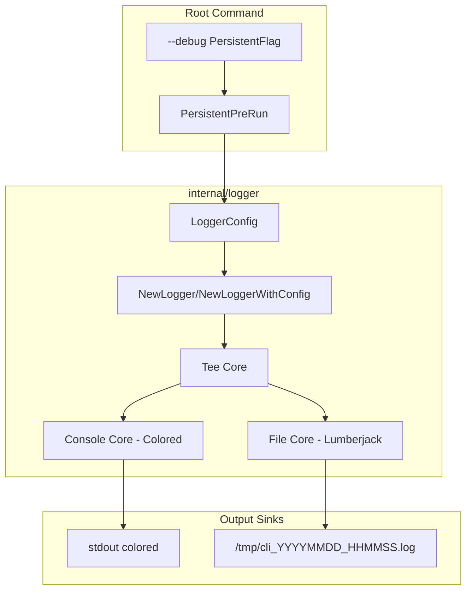

# CLI Debug 模式与日志增强方案

## 现状

- [internal/logger/logger.go](internal/logger/logger.go)：固定 InfoLevel，仅输出到 stdout，无颜色
- [internal/config/types.go](internal/config/types.go)：已有 `Debug bool` 字段，但未参与日志
- 使用 logger 的模块：cmd/archive、cmd/printer、internal/printer、internal/doctor（部分）

## 架构设计

## 实施步骤

### Phase 1: Logger 核心改造

**1.1 扩展** [internal/logger/logger.go](internal/logger/logger.go)

- 新增 `LoggerConfig` 结构体：
  - `Debug bool`：为 true 时使用 `DebugLevel`，否则 `InfoLevel`
  - `LogPath string`：日志文件路径，空则仅输出到控制台
  - `LogRotation`：MaxSize(10MB)、MaxBackups(3)、MaxAge(7 天)
- 实现 `NewLoggerWithConfig(cfg LoggerConfig) *zap.Logger`
- 控制台输出：使用 `zapcore.CapitalColorLevelEncoder`，终端有颜色
- 文件输出：使用 `lumberjack.Logger` 做轮转，JSON 或行式格式
- 双输出：`zapcore.NewTee(consoleCore, fileCore)` 同时写入控制台和文件
- 默认路径：`filepath.Join(os.TempDir(), "cli_"+time.Now().Format("20060102_150405")+".log")`

**1.2 依赖**

- 添加 `gopkg.in/natefinch/lumberjack.v2`（或 `github.com/natefinch/lumberjack`）

**1.3 保持向后兼容**

- `NewLogger()` 保留，内部调用 `NewLoggerWithConfig defaults`，行为与当前一致（InfoLevel、仅 stdout）

### Phase 2: 全局 --debug 与上下文传递

**2.1 修改** [cmd/root.go](cmd/root.go)

- 添加 `rootCmd.PersistentFlags().BoolVarP(&debugMode, "debug", "d", false, "Enable debug logging")`
- 在 `PersistentPreRunE` 中：
  - 读取 `--debug` 和 `config.Root.Debug`（以 flag 优先）
  - 构建 `LoggerConfig`（path 默认 `tmp/cli_时间戳.log`）
  - 调用 `logger.SetGlobalLogger(logger.NewLoggerWithConfig(...))`

**2.2 新增** [internal/logger/global.go](internal/logger/global.go)

- `var global *zap.Logger`、`var globalOnce sync.Once`
- `func SetGlobalLogger(l *zap.Logger)`：供 root 在 PreRun 时设置
- `func Global() *zap.Logger`：返回全局 logger，未设置时返回默认 NewLogger()
- 用于各 cmd 在需要时统一获取 logger

### Phase 3: 各模块接入统一 Logger

**3.1 需要改动的调用点**

| 位置 | 当前用法 | 改为 |
|------|----------|------|
| cmd/archive/command.go | `logger.NewLogger()` | `logger.Global()` |
| cmd/printer/command.go | `logger.NewLogger()` | `logger.Global()` |
| internal/printer/* | 接收 `*zap.Logger` 参数 | 保持参数，调用方传 `logger.Global()` |
| internal/doctor/* | 无 logger | 可选择性加 Debug 日志 |

**3.2 注入方式**

- 在 root 的 `PersistentPreRun` 中设置全局 logger 后，各子命令使用 `logger.Global()` 即可获得受 `--debug` 控制的 logger

### Phase 4: 大面积 Debug 日志

在以下模块补充 `log.Debug()`：

- **internal/config**：Load/Save 时记录路径、默认值
- **internal/wormhole**：握手、加解密、收发帧、UI 事件
- **internal/doctor**：各 checker 执行前后、端口探测
- **internal/printer**：discover/print/scan 流程关键步骤
- **internal/fsutil**：Walk 过滤、目录跳过
- **internal/meta**：解析 metadata 的字段
- **cmd/config**：list/use/add/rm 执行前后
- **cmd/wormhole**：send/receive 的 relay 地址、code
- **cmd/history**：add 的文件路径、history 路径

原则：入口/出口、分支判断、错误分支、关键数据结构变更处加 Debug。

### Phase 5: 日志路径与轮转配置

**5.1 默认路径**

- `os.TempDir() + "/cli_" + time.Now().Format("20060102_150405") + ".log"`
- 例如：`/tmp/cli_20260210_193045.log`（Linux）

**5.2 可选：通过 config 或 env 覆盖**

- `config.Root` 可增加 `LogPath`、`LogRotation` 字段（Phase 1 后可迭代）
- 或通过 `CLI_LOG_PATH` 环境变量覆盖

**5.3 Lumberjack 参数**

- MaxSize: 10
- MaxBackups: 3
- MaxAge: 7
- Compress: true（可选）

## 文件变更清单

| 操作 | 路径 |
|------|------|
| 重写/扩展 | internal/logger/logger.go |
| 新增 | internal/logger/global.go |
| 修改 | cmd/root.go |
| 修改 | internal/config/types.go（可选，LogPath 等） |
| 修改 | go.mod（lumberjack） |
| 修改 | 所有使用 logger 的 cmd 与 internal 包 |

## 风险与注意

1. **init 顺序**：Cobra 的 `init()` 在 `Execute()` 之前执行，PersistentPreRun 在子命令运行前执行，因此 PreRun 中设置全局 logger 时机正确。
2. **颜色与管道**：`CapitalColorLevelEncoder` 在非 TTY 时会自动禁用颜色（zap 行为）。
3. **临时目录**：不同 OS 的 `os.TempDir()` 不同，Windows 为 `%TEMP%`，需保证目录可写。
